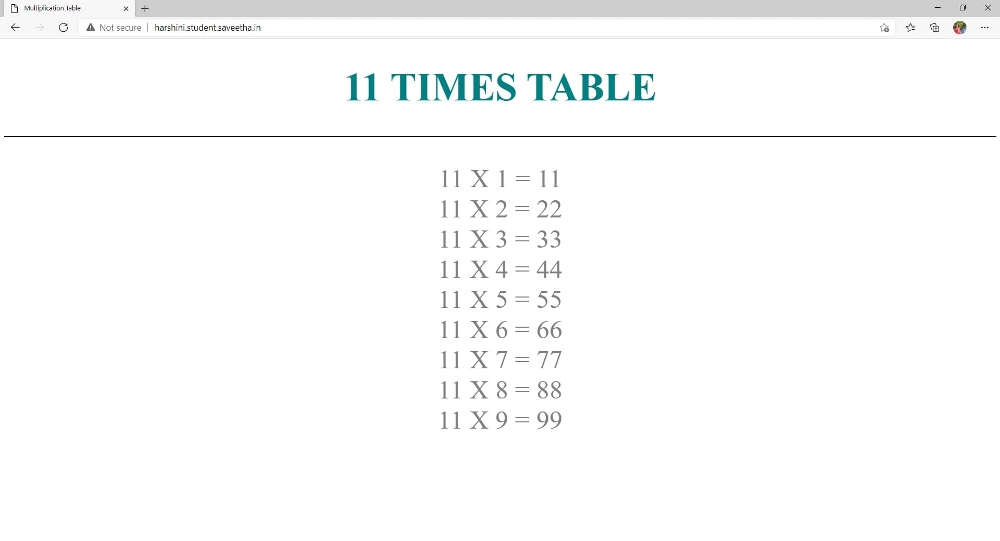

# Developing a Simple Webserver
## AIM:
To develop a simple webserver to serve html pages.

## DESIGN STEPS:
### Step 1: 
HTML content creation
### Step 2:
Design of webserver workflow
### Step 3:
Implementation using Python code
### Step 4:
Serving the HTML pages.
### Step 5:
Testing the webserver

## PROGRAM:
```
from http.server import HTTPServer , BaseHTTPRequestHandler

content = """
<!DOCTYPE html>
<html>
<head><title>Multiplication Table</title>
</head>
<body>
<style>
h1 {
     color: teal;
     font-family: times new roman italic;
     font-size: 450%;
     text-align: center
}
hr {
     border: 1px solid black
}
p {
     color:gray;
     font-family: verdana italic;
     font-size: 300%;
     text-align: center
}
</style>
<h1>11 TIMES TABLE</h1>
<hr>
<p> 
  
   11 X 1 = 11 <br/>
   11 X 2 = 22 <br/>
   11 X 3 = 33 <br/>
   11 X 4 = 44 <br/>
   11 X 5 = 55 <br/>
   11 X 6 = 66 <br/>
   11 X 7 = 77 <br/>
   11 X 8 = 88 <br/>
   11 X 9 = 99 <br/>
</p>
</body>
</html>"""

class MyHandler(BaseHTTPRequestHandler):
    def do_GET(self):
        print("request received")
        self.send_response(200)
        self.send_header('Content-type' , 'text/html; charset=utf-8')
        self.end_headers()
        self.wfile.write(content.encode())


server_address = ('',80)
httpd= HTTPServer(server_address,MyHandler)
print("My webserver is running...")
httpd.serve_forever()
```

## OUTPUT:


## RESULT:
Thus a simple webserver is developed to serve html pages and is hosted in the URL http://harshini.student.saveetha.in/. HTML code is validated.